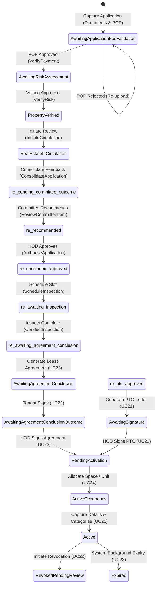

# Unified Use Cases & Dev Mapping: Real Estate Development (RED) System
**Version 1.1**  
*The authoritative reference and "lore" for the Real Estate Lease Management System (DPRE/RED).*

---

## 1. System Overview
The Development Planning & Real Estate (DPRE) system manages the lifecycle of commercial and professional land/facility leases for the City of Ekurhuleni (CoE). Unlike residential systems, the Real Estate system integrates property capture, payment upload, document pre-qualification, inter-departmental circulation, and early occupancy (Permission to Occupy) into a unified lease workflow.

To guarantee complete isolation, the Real Estate branch uses **dedicated database tables, custom controllers, and segregated views**, with zero dependency or leakage into other systems in the repository.

---

## 2. Database Updates & Schema Reference

### 2.1 Core Tables
* **`RE_Applications`**: Stores all data relating to the applicant's profile, lease specifications, departmental feedback consolidation, inspections, works orders, and PTO requests (banking columns are retained as nullable fields but removed from user input).
* **`RE_DepartmentalComments`**: Tracks inputs from multiple CoE departments (Energy, Water, City Planning, etc.) for each application.
* **`RE_Facilities`** and **`RE_FacilityUnits`**: Manages the inventory of physical structures available for lease (e.g. Retail Units, Offices, Professional spaces).
* **`RE_FacilityCategories`**: Houses the tariff matrices, dimensions, and usage types.
* **`PLMApplicationHistortyLogs`**: Stores the application audit trail / history log entries (linked via `RealEstateApplicationId`). Each row records a timestamped `AuditAction` string.

### 2.2 Seeded Status Keys (`Status` Table)
The following statuses govern the state machine of the Real Estate workflow:

| Status Key | Display Name | Phase |
| :--- | :--- | :--- |
| `s_awaiting_application_fee_validation` | In Awaiting Application Fee Validation | 1. Capture & Payment |
| `s_awaiting_risk_assessment` | Awaiting Risk Assessment Outcome | 2. Vetting |
| `s_property_verified` | Property Verified | 3. Evaluation |
| `re_in_circulation_for_evaluation` | In Circulation for Evaluation | 3. Evaluation (Departmental Comments) |
| `re_supported` | Supported | 3. Evaluation (Departmental Comments) |
| `re_supported_conditions` | Supported with Conditions | 3. Evaluation (Departmental Comments) |
| `re_not_supported` | Not Supported | 3. Evaluation (Departmental Comments) |
| `re_additional_info_req` | Request Additional Information | 3. Evaluation (Departmental Comments) |
| `re_pending_committee_outcome` | Pending Evaluation Committee Outcome | 4. Committee & HOD Review |
| `re_recommended` | Recommended | 4. Committee & HOD Review |
| `re_recommended_conditions` | Recommended with Conditions | 4. Committee & HOD Review |
| `re_not_recommended` | Not Recommended | 4. Committee & HOD Review |
| `re_deferred` | Deferred | 4. Committee & HOD Review |
| `s_awaiting_hod_response` | Awaiting HOD Response (Escalated) | 4. Committee & HOD Review |
| `re_concluded_approved` | Application Concluded & Approved | 5. Concluded |
| `re_concluded_rejected` | Application Concluded & Rejected | 5. Concluded |
| `re_awaiting_inspection` | Awaiting Inspection | 6. Occupancy (Inspection) |
| `re_awaiting_agreement_conclusion` | Awaiting Lease/User Agreement Conclusion | 6. Occupancy (Lease Signature) |
| `re_awaiting_pto_review` | Awaiting PTO Review | 7. PTO (Permission to Occupy) |
| `re_awaiting_pto_approval` | Awaiting PTO Approval | 7. PTO (Permission to Occupy) |
| `re_pto_approved` | PTO Approved | 7. PTO (Permission to Occupy) |
| `re_pto_rejected` | PTO Rejected | 7. PTO (Permission to Occupy) |
| `re_pto_approved_conditions` | PTO Approved with Conditions | 7. PTO (Permission to Occupy) |
| `re_pto_additional_info` | Awaiting PTO Review, Additional Info Req | 7. PTO (Permission to Occupy) |

---

## 3. Controller & Action Mapping

All Real Estate workflows are driven by two main controllers. 

### 3.1 `RealEstateController.cs` (Client-Facing)
Manages actions taken by the Applicant:
* **`Capture (GET/POST)`**: Displays the multi-part capture form. Captures company registration details, dynamic facility and unit selection (no banking details captured), and uploads the expanded list of mandatory pre-qualification files (including proof of payment). Saves to `RE_Applications` in status `s_awaiting_application_fee_validation`.
* **`MyApplications (GET)`**: Displays a list of submitted Real Estate applications and allows the applicant to view a progress summary modal.
* **`LeaseAgreements (GET)`**: Lists approved leases for the logged-in customer to view inspections, Works Orders, or request early occupancy.
* **`SelectInspectionSlot (GET/POST)`**: Enables the tenant to confirm a pre-occupancy inspection slot or propose a new date/time.
* **`RequestPto (GET/POST)`**: Standard form to request early access. Validates that the request dates do not exceed 12 months, and that the start date is in the future.

### 3.2 `RealEstateAdminController.cs` (Back-Office)
Manages actions taken by internal officials, assessors, committees, and the HOD:
* **`ApplicationFeePayments (GET)`** & **`VerifyPayment (GET/POST)`**: Used by the Finance Officer to review and approve/reject the uploaded proof of payment. Updates status to `s_awaiting_risk_assessment`.
* **`RiskAssessments (GET)`** & **`VerifyRisk (GET/POST)`**: Used by the Property Officer to record results from credit bureaus, CIPC, deeds, Home Affairs, and recommend/not recommend. Updates status to `s_property_verified`.
* **`InitiateCirculation (POST)`**: Allows the Property Officer to forward a verified application to CoE departments. Sets status to `re_in_circulation_for_evaluation`.
* **`DepartmentalQueue (GET)`** & **`CaptureDepartmentalComment (GET/POST)`**: Used by Departmental Delegates (e.g. Energy, Environmental Health) to register their recommendations (Supported, Supported with Conditions, Not Supported, Request Info) and write feedback.
* **`ConsolidateFeedback (GET)`** & **`ConsolidateApplication (GET/POST)`**: The Property Officer reviews all departmental comments. Submitting routes to the Evaluation Committee (`re_pending_committee_outcome`), while Escalating sends it directly to the HOD (`s_awaiting_hod_response`).
* **`CommitteeReviews (GET)`** & **`ReviewCommitteeItem (GET/POST)`**: Secretariat records the DPRE Evaluation Committee resolution, uploads the resolution PDF, and registers the decision (Recommended, Recommended with Conditions, Not Recommended, Deferred).
* **`FinalAuthorisation (GET)`** & **`AuthoriseApplication (GET/POST)`**: The HOD reviews recommendations and signs off using an on-screen signature pad, concluding the application as Approved (`re_concluded_approved`) or Rejected.
* **`InspectionSchedules (GET)`** & **`ScheduleInspection (GET/POST)`**: Officer schedules slots for pre-occupancy unit walkthroughs.
* **`ConductInspections (GET)`** & **`ConductInspection (GET/POST)`**: Officer records the structural checklist (plumbing, electrical, fixtures) and uploads the signed inspection sheet. Can trigger an ad-hoc Works Order (status `Logged`).
* **`WorkOrders (GET)`** & **`AuthoriseWorkOrder (GET/POST)`**: Manager reviews logged works orders, captures their signature, and assigns internally or externally (SCM).
* **`PtoReviews (GET)`** & **`ReviewPto (GET/POST)`**: Officer reviews early access requests and provides recommendation.
* **`PtoAuthorisations (GET)`** & **`AuthorisePto (GET/POST)`**: HOD signs off on PTO with conditions or rejects/approves.

### 3.3 View Information Panels (All Review Pages)
Each back-office review/decision page (Departmental Comment, Committee Review, HOD Authorisation) renders the following information panels to enable informed decision-making:
1. **Applicant Details Header** — Name, type, purpose of lease, calculated rental.
2. **Risk Assessment & Credit Review** — Credit Bureau, Deeds Registry, Home Affairs, SARS/CIPC, SASSA, Risk Recommendation.
3. **Applicant Uploaded Documents** — With "View File" download links via `FileController.GetDocument`.
4. **Departmental Comments Summary** — All captured comments with department name, outcome, representative, and date (where applicable, i.e. Committee Review & HOD pages).
5. **Application History Log & Audit Trail** — Chronological table sourced from `PLMApplicationHistortyLogs`.
6. **Consolidated Report PDF Download** — "Download PDF Report" button using Rotativa `ActionAsPdf`.

---

## 4. Razor Views Directory
The user interface is built on a dark Obsidian design system with custom card layouts, grid systems, and glassmorphic tables:

### 4.1 Client Views (`Views/RealEstate/`)
* **`Capture.cshtml`**: Glassmorphic multi-tab form with dynamic dropdowns, dynamic tariff calculators, and drag-and-drop document upload areas.
* **`MyApplications.cshtml`**: Progress table featuring visual status badges and modal details.
* **`LeaseAgreements.cshtml`**: Active agreement list displaying unit inspection statuses and action buttons.
* **`SelectInspectionSlot.cshtml`**: Interactive appointment confirmation board.
* **`RequestPto.cshtml`**: Clean request panel with date constraints and indemnity checks.

### 4.2 Back-Office Views (`Views/RealEstateAdmin/`)
* **`ApplicationFeePayments.cshtml`** / **`VerifyPayment.cshtml`**: Side-by-side POP PDF viewer and verification action card.
* **`RiskAssessments.cshtml`** / **`VerifyRisk.cshtml`**: Vetting questionnaire checklist interface.
* **`DepartmentalQueue.cshtml`** / **`CaptureDepartmentalComment.cshtml`**: Unified feedback panel with credit review, documents, history log, and optional condition upload blocks.
* **`ConsolidateFeedback.cshtml`** / **`ConsolidateApplication.cshtml`**: Grid matching departmental comments side-by-side with PDF download button.
* **`CommitteeReviews.cshtml`** / **`ReviewCommitteeItem.cshtml`**: Full application detail panels (documents, credit checks, departmental comments, history log, PDF download) plus upload card for Committee Resolution PDF.
* **`FinalAuthorisation.cshtml`** / **`AuthoriseApplication.cshtml`**: Full application detail panels (documents, credit checks, departmental comments, committee outcome, history log, PDF download) plus HOD Signoff panel featuring HTML5 canvas signature pad.
* **`ConsolidatedReportPdf.cshtml`**: Print-friendly Rotativa view for PDF generation of the consolidated departmental review report.
* **`InspectionSchedules.cshtml`** / **`ScheduleInspection.cshtml`**: Officer inspection scheduler page.
* **`ConductInspections.cshtml`** / **`ConductInspection.cshtml`**: Unit check lists with optional "Works Order Capture" expansion form.
* **`WorkOrders.cshtml`** / **`AuthoriseWorkOrder.cshtml`**: Maintenance dashboard with Priority level indicators and SCM select options.
* **`PtoReviews.cshtml`** / **`ReviewPto.cshtml`**: RED Officer early access vetting forms.
* **`PtoAuthorisations.cshtml`** / **`AuthorisePto.cshtml`**: Final HOD authorization signature screen for PTO.

---

## 5. Unified Use Cases (RE_UC001 - RE_UC025)

### RE_UC001: Register User Profile
* **Actor**: Applicant
* **Description**: Create new profile to gain system access.
* **Flow**: Capture details → OTP/Verification → Account Activated.

### RE_UC002: Update User Profile
* **Actor**: Applicant
* **Description**: Capture residential, billing, and contact addresses on initial login.

### RE_UC003: Approve Profile Registration
* **Actor**: System Administrator
* **Description**: Approve/reject customer profile registration from the back-office Maintenance dashboard.

### RE_UC004: Login
* **Actor**: Applicant / Official
* **Description**: Access account with credential checking and password recovery flows.

### RE_UC005: Submit Application for Lease
* **Actor**: Applicant (`RealEstateCustomer`) / Property Officer (on behalf)
* **Description**: Dynamic Customer Care Area (CCC) selection (sorted alphabetically) and multiple facility letting unit selection (supporting selecting multiple units from different facilities, calculatingEstimated Monthly Rental based on the sum of all selections). Includes strict formatting validations:
  * Company Registration Number: Format must be `YYYY/NNNNNN/NN` (CIPC standard).
  * SARS Tax Reference Number: Exactly 10 digits (numeric).
  * VAT Registration Number: Exactly 10 digits starting with `4`.
  * Postal Codes (Entity & Property): Exactly 4 digits (numeric).
  * Telephone, Mobile, and Fax Numbers: Exactly 10 digits starting with `0`.
  Provides a "Remove/Delete" button next to each uploaded pre-qualification document to reset files before submission. Generates sequential application reference numbers starting with the `DPRE-` prefix (e.g. `DPRE-20260712-0001`). No banking details are captured. Saves with status `s_awaiting_application_fee_validation`.
* **Navigation**: Real Estate Applications → Submit Application for Lease
* **Controller**: `RealEstateController.Capture`

### RE_UC006: Validate Proof of Payment
* **Actor**: Finance Officer (`re_finance_officer`)
* **Description**: Review POP. Approving moves status to `Awaiting Risk Assessment Outcome`. Rejecting emails applicant for re-upload.
* **Navigation**: Real Estate Queue → Validate Proof of Payment
* **Controller**: `RealEstateAdminController.VerifyPayment`

### RE_UC007: Capture Risk Assessment Outcome
* **Actor**: Property Officer (`re_property_officer`)
* **Description**: Input results from Deeds, CIPC, Credit Bureau, Home Affairs. Recommend transitions to `PropertyVerified`. Not Recommend transitions to `Rejected`.
* **Navigation**: Real Estate Queue → Capture Risk Assessment Outcome
* **Controller**: `RealEstateAdminController.VerifyRisk`

### RE_UC008: Initiate Departmental Review
* **Actor**: Property Officer (`re_property_officer`)
* **Description**: Send applicant information to CoE departments for assessment. Status moves to `In Circulation for Evaluation`.
* **Navigation**: Real Estate Queue → Initiate Departmental Review → Send for Review
* **Controller**: `RealEstateAdminController.InitiateCirculation`

### RE_UC009: Capture Departmental Reviews & Comments
* **Actor**: Property Officer (`re_property_officer`) / Departmental Official
* **Description**: Select outcome (Supported, Supported with Conditions, Not Supported, Info Request). Status becomes the selected outcome.
* **Navigation**: Real Estate Queue → Capture Departmental Reviews and Comments → Capture Comments
* **Controller**: `RealEstateAdminController.CaptureDepartmentalComment`

### RE_UC010: Consolidate Departmental Feedback
* **Actor**: Property Officer (`re_property_officer`)
* **Description**: Compile outcomes. Click "Generate Consolidated Report" to auto-compile. Submit sends it to Evaluation Committee (`re_pending_committee_outcome`). Escalate sends it to HOD (`s_awaiting_hod_response`).
* **Navigation**: Real Estate Queue → Consolidate Departmental Feedback → Action → Generate Consolidated Report → Send to Evaluation Committee
* **Controller**: `RealEstateAdminController.ConsolidateApplication`

### RE_UC011: Committee Review and Decision
* **Actor**: Committee Member (`re_committee_member`)
* **Description**: Record committee resolution (Recommended, Recommended with Conditions, Not Recommended, Deferred), upload resolution file.
* **Navigation**: Real Estate Queue → Committee Review and Decision → Review Item
* **Controller**: `RealEstateAdminController.ReviewCommitteeItem`

### RE_UC012: Application Final Authorisation
* **Actor**: HOD (`re_hod`)
* **Description**: Provide final approval or rejection with on-screen signature. Updates status to `re_concluded_approved` or `re_concluded_rejected`.
* **Navigation**: Real Estate Queue → Application Final Authorisation → Authorise Application
* **Controller**: `RealEstateAdminController.AuthoriseApplication`

### RE_UC013: Schedule Unit Inspection
* **Actor**: Property Officer (`re_property_officer`) → Applicant (`RealEstateCustomer`)
* **Description**: Officer proposes date slots. Applicant logs in and selects a slot or proposes a counter-date. Status moves to `Awaiting Inspection`.
* **Navigation (Officer)**: Real Estate Queue → Schedule Unit Inspection → Schedule Slot
* **Navigation (Client)**: My Applications → View Inspection Slots → Confirm Slot
* **Controller**: `RealEstateAdminController.ScheduleInspection`, `RealEstateController.SelectInspectionSlot`

### RE_UC014: Conduct Unit Inspection
* **Actor**: Property Officer (`re_property_officer`)
* **Description**: Fill condition checklists (plumbing, electrical, wear/tear), upload signed form. Can capture Works Order details to trigger maintenance. Status moves to `Awaiting Lease/User Agreement Conclusion`.
* **Navigation**: Real Estate Queue → Conduct Unit Inspection → Action
* **Controller**: `RealEstateAdminController.ConductInspection`

### RE_UC015: Authorise and Assign Works Order Request
* **Actor**: Facilities Manager (`re_facilities_manager`)
* **Description**: Approve works order, sign, and assign internally or externally (SCM). Updates status to `Assigned`.
* **Navigation**: Facilities Queue → Authorise and Assign Works Order Request → Action
* **Controller**: `RealEstateAdminController.AuthoriseWorkOrder`

### RE_UC016: Create Maintenance Schedule
* **Actor**: Facilities Manager (`re_facilities_manager`)
* **Description**: Formulate preventive maintenance rules and schedule cycles for assets/leased units.
* **Navigation**: Create Maintenance Schedule → Schedule Recurrent Activity
* **Controller**: `RealEstateAdminController` (Maintenance Planning actions)

### RE_UC017: Log and Track Ad Hoc Maintenance Requests
* **Actor**: Facilities Manager (`re_facilities_manager`) → Technician (`re_technician`)
* **Description**: Log requests. Assign technician. Technician accepts, performs repairs, uploads Job Sheet. Manager closes.
* **Navigation (Assign)**: Facilities Queue → Log and Track Ad Hoc Maintenance Requests → Assign
* **Navigation (Technician)**: My Tasks → Job Allocations → Accept Work Order → Update Job → Complete Job
* **Navigation (Close)**: Facilities Queue → Close Work Orders → Verify and Close
* **Controller**: `RealEstateAdminController` (WorkOrder assignment, close actions)

### RE_UC018: Request Permission to Occupy (PTO)
* **Actor**: Applicant (`RealEstateCustomer`)
* **Description**: Submit request for early access during agreement conclusion. Upload Certificate of Insurance, Fit-out Plans, and Health & Safety clearances. Check Indemnity Declaration. Status moves to `Awaiting PTO Review`.
* **Navigation**: My Applications → Request Early Occupation
* **Controller**: `RealEstateController.RequestPto`

### RE_UC019: Review Permission to Occupy
* **Actor**: Property Officer (`re_property_officer`)
* **Description**: Assess PTO request and submit recommendation to HOD. Status moves to `Awaiting PTO Approval`.
* **Navigation**: Real Estate Queue → PTO Reviews → Review PTO
* **Controller**: `RealEstateAdminController.ReviewPto`

### RE_UC020: Approve/Authorise Permission to Occupy
* **Actor**: HOD (`re_hod`)
* **Description**: Approve/reject PTO request and capture signature. Status updates to `PTO Approved` or `PTO Rejected`.
* **Navigation**: Real Estate Queue → PTO Authorisations → Authorise PTO
* **Controller**: `RealEstateAdminController.AuthorisePto`

### RE_UC021: Generate and Sign Permission to Occupy Certificate/Letter
* **Actor**: Property Officer (`re_property_officer`), Delegated Official (`re_hod`)
* **Description**: Process to generate the official Permission To Occupy certificate/letter. Pre-populated from template (valid for 12 months). Signatures captured for activation. 
* **Navigation (Officer)**: Applications → Lease Agreements → PTO Approvals (Generates draft and submits for signature)
* **Navigation (HOD)**: Applications → Lease Agreements → PTO Approvals (Approves/rejects and signs)
* **Controller**: `RealEstateAdminController`
* **Status Transition**: `re_pto_approved` / `re_pto_approved_conditions` ➔ `Pending Activation` (or `Approved` / `Approved with Conditions` if rejected to queue).

### RE_UC022: Revoke or Expire Permission to Occupy
* **Actor**: Property Officer (`re_property_officer`), System (Background)
* **Description**: Process to manage termination or expiry of a PTO. Property Officer initiates revocation with mandatory comments and supporting files. System expires automatically 7 days before end date.
* **Navigation (Officer)**: Applications → Lease Agreements → Active PTO
* **Controller**: `RealEstateAdminController` (Manual revocation), Background worker (Automated expiry)
* **Status Transition**: `Active` ➔ `Revoked, Pending Review` or `Expired`.

### RE_UC023: Generate and Sign Lease/User Agreement
* **Actor**: Property/LED Officer (`re_property_officer`), Applicant/Tenant (`RealEstateCustomer`), HOD (`re_hod`)
* **Description**: Generates a standard lease agreement (valid for 36 months). Tenant views, downloads, signs, and uploads the agreement. HOD reviews and signs off to activate.
* **Navigation (Officer)**: Applications → Lease Agreements → New Leases
* **Navigation (Tenant)**: Applications → Lease Agreements
* **Navigation (HOD)**: Applications → Lease Agreements → Lease/User Agreement Approvals
* **Controller**: `RealEstateController` (Tenant views/signs/uploads), `RealEstateAdminController` (Officer generation & HOD signoff)
* **Status Transition**: `re_concluded_approved` ➔ `Awaiting Agreement Conclusion` ➔ `Awaiting Agreement Conclusion Outcome` ➔ `Pending Activation` (36 months validity).

### RE_UC024: Lease Space/Unit Allocation
* **Actor**: Property/LED Officer (`re_property_officer`)
* **Description**: Allocates approved available units to the tenant. Confirm pre-conditions (signed agreement, deposit payment, completed inspection). Assign/allocate changes unit status to `Allocated`.
* **Navigation**: Applications → Lease Agreements → New Leases → Allocations
* **Controller**: `RealEstateAdminController`
* **Status Transition**: `Pending Activation` ➔ `Active Occupancy` (Unit status updates to `Allocated`). Alternate: `Delayed Allocation`.

### RE_UC025: Capture Lease Details and Classify Lease Categories
* **Actor**: Property/LED Officer (`re_property_officer`)
* **Description**: Records full lease information and assigns a lease category (Temporary Occupation, Lease/User Agreement Term, Month-To-Month, Long-Term). Generates a Unique Tenancy Lease Number.
* **Navigation**: Active Leases → Active Occupancy
* **Controller**: `RealEstateAdminController` / `RealEstateController`
* **Status Transition**: `Active Occupancy` ➔ `Active` (Lease status becomes `Active`).

---

## 6. User Routing, Roles & Actor Assignment
**Authoritative Routing Architecture and Lore**

### 6.1 Current Code-Level Implementation & Queue Gaps
* **Class-Level Authorization:** In `RealEstateAdminController.cs`, the controller is decorated with:
  `[Authorize(Roles = "Administrators, Area Managers, Property Managers, Back Office System Administrator, Property Manager, Area Manager, Finance Administrator, Property & Facilities Manager, Caretaker")]`
* **Lack of Action Filtering:** The action methods (e.g., `ApplicationFeePayments`, `DepartmentalQueue`, `ConsolidateFeedback`) query all active applications in a particular state without filtering by the logged-in user's role, customer care center (`CCCId`), or department (`DepartmentId`).
* **Missing Assigned User Field:** The `RE_Applications` table tracks the applicant (`SystemUserId`), but lacks an `AssignedSystemUserId` column. This means tasks in the back-office cannot currently be locked or routed to specific officials; they act as a shared pool where any authorized user sees all active items.

### 6.2 Seeded Test Users for Role-Based Routing E2E Testing

> [!IMPORTANT]
> **Canonical User-to-Role Mapping for ALL Testing**
> The following users are the **only** accounts to use in E2E testing. Do NOT use `BOSystemAdminstrator` or `SolarTest01` for Real Estate workflows.

| Username | Password | Role | Purpose / Queue |
| :--- | :--- | :--- | :--- |
| `RealEstateCustomer` | `Arsenal5@` | Lease Applicant (Client) | Submit application, confirm inspection slots, request PTO |
| `re_finance_officer` | `Arsenal5@` | Finance Administrator | Verify application fee payment (POP) |
| `re_property_officer` | `Arsenal5@` | Property Manager | Risk assessment, departmental reviews, inspections, PTO reviews |
| `re_committee_member` | `Arsenal5@` | Area Manager | Log Evaluation Committee resolutions |
| `re_hod` | `Arsenal5@` | Back Office System Administrator | Final lease contract awards, final PTO approval |
| `re_facilities_manager` | `Arsenal5@` | Property & Facilities Manager | Authorise/Route Works Orders, PM planning, assign technicians, close Works Orders |
| `re_technician` | `Arsenal5@` | Caretaker | Accept maintenance jobs, upload job sheets |

### 6.3 Vetting Department Mappings & Configuration
To support the inter-departmental circulation and evaluation workflow (UC 08 & UC 09), the system maps each City of Ekurhuleni (CoE) department to a specific back-office representative Clerk:

| Department ID | Department Name | Representative User | Mapped Role | Workflow Role / Actions |
| :--- | :--- | :--- | :--- | :--- |
| 1 | City Planning | `re_city_planning` | Departmental Representative | Review applications and capture comments |
| 2 | Corporate Legal Services | `re_legal` | Departmental Representative | Review applications and capture comments |
| 3 | Disaster and Emergency Management | `re_disaster` | Departmental Representative | Review applications and capture comments |
| 4 | Economic Development | `re_economic` | Departmental Representative | Review applications and capture comments |
| 6 | Ekurhuleni Metro Police Department (EMPD) | `re_empd` | Departmental Representative | Review applications and capture comments |
| 7 | Energy | `re_energy` | Departmental Representative | Review applications and capture comments |
| 8 | Environmental Resource and Waste Management | `re_environmental` | Departmental Representative | Review applications and capture comments |
| 9 | Finance | `re_finance_officer` | Finance Administrator & Dept Rep | Verify application fee payment (POP) |
| 10 | Health and Social Development | `re_health` | Departmental Representative | Review applications and capture comments |
| 11 | Human Settlements | `re_human_settlements` | Departmental Representative | Review applications and capture comments |
| 12 | Information and Communication Technology | `re_ict` | Departmental Representative | Review applications and capture comments |
| 13 | Roads and Stormwater | `re_roads` | Departmental Representative | Review applications and capture comments |
| 14 | Sports, Recreation Arts and Culture | `re_sports` | Departmental Representative | Review applications and capture comments |
| 15 | Transport Planning and Provision | `re_transport` | Departmental Representative | Review applications and capture comments |

> [!TIP]
> The database initialization script for configuring these roles, representative users, department IDs, and vetting department mappings is stored in the repository at [RE_WorkflowSetup_Data.sql](file:///C:/REPO/PLM%20V1/DatabaseScripts/RE_WorkflowSetup_Data.sql). This script can be run on any new environment to automatically seed these configurations.

### 6.4 Routing & Gaps Clarification Questions for the Business Analyst (BA)

> [!IMPORTANT]
> **BA Clarification Required: Task Allocation Strategy & Regional Boundaries**
> 1. **Shared Pools (Pull) vs. Individual Assignment (Push):** 
>    * When an application moves to a new state (e.g. `s_awaiting_application_fee_validation`), does it sit in a shared queue where any official in that role can view and click "Claim" to own it?
>    * Or is it explicitly assigned to a specific user (push model) based on load or a round-robin algorithm? If push, should we add `AssignedSystemUserId` and `LockedByUserId` columns to `RE_Applications`?
> 2. **Departmental Delegate Mapping & Fallbacks:** 
>    * CoE departments (Energy, Water, City Planning, Roads, etc.) are defined in `DepartmentsCoEs` where a delegate is assigned via the `RepresentedBy` column. Currently, only some departments have delegates mapped.
>    * What is the fallback behavior if a department has no delegate assigned? Should the system bypass that department, send it to a general admin pool, or flag an error?
> 3. **Geographical CCC-based Routing:** 
>    * During capture, the applicant selects a Customer Care Centre (e.g., Tokoza CCC). Does this centre dictate which officials handle the workflow?
>    * *Example:* If an application is submitted for Tokoza CCC, should the payment validation and inspection schedule tasks only be visible to `re_property_officer` who is mapped to Tokoza CCC (10), while Boksburg officials are blocked from seeing it?
> 4. **Technician and Work Order Allocation:**
>    * When a Works Order is logged, does the Facilities Manager select a technician manually from a dropdown of active technicians? Or should the system auto-assign based on geographic area/technician workload?
> 5. **HOD Delegation and Acting Signatures:**
>    * For final authorizations and PTO approvals (which require the HOD's signature), is there a delegation of authority (DoA) screen? If the HOD is out of office, can they nominate a delegate user to authorize leases on their behalf?

---

## 7. Alternative Flows & Negative Use Case Testing Plan

To ensure system resilience, the following negative test cases should be executed:

### 7.1 Phase 1: Capture & Payment Validation
* **TC-NEG-001 (Invalid file extensions during capture):** Attempt to upload an executable (`.exe`) or text file (`.txt`) to the pre-qualification slots (which restrict to `.pdf`, `.png`, `.jpg`).
  * *Expected Result*: Upload is rejected, client validation throws warning, submit remains disabled.
* **TC-NEG-002 (Incorrect format validation):** Submit registration or tax reference numbers with incorrect formats (e.g. registration number without slash separators, or tax reference number with 9 digits).
  * *Expected Result*: Model state fails validation, page reloads with inline validation messages.
* **TC-NEG-003 (Payment rejection flow):** Admin rejects POP payment without entering a comment.
  * *Expected Result*: Validation prevents submission, throws error: *"A reason is required to reject the payment."*
* **TC-NEG-004 (Payment rejection success):** Admin rejects POP payment *with* a comment.
  * *Expected Result*: Status remains in validation/query state. Applicant is notified via email containing the rejection reason.

### 7.2 Phase 2: Circulation & Departmental Comments
* **TC-NEG-005 (Consolidation without comments):** Property Officer tries to consolidate departmental feedback before all departments have submitted comments.
  * *Expected Result*: System warning: *"Feedback is missing from: [Department Name]. Cannot consolidate."*
* **TC-NEG-006 (Consolidation with Not Supported outcomes):** Property Officer tries to submit consolidation where one or more departments flagged "Not Supported".
  * *Expected Result*: System blocks standard committee submission and forces the officer to either escalate to the HOD or query the application.

### 7.3 Phase 3: Final Sign-off & Occupancy
* **TC-NEG-007 (HOD Rejection):** HOD rejects application in Final Authorisation without providing signature or comments.
  * *Expected Result*: Form validation blocks submission, highlighting comments and signature area.
* **TC-NEG-008 (Inspection slot clash):** Attempt to schedule an inspection slot on a Sunday or outside CoE working hours (08:00 - 16:30).
  * *Expected Result*: Datepicker constraints restrict select, server validation throws range error.
* **TC-NEG-009 (Invalid PTO dates):** Request PTO with start date in the past, or end date exceeding 12 months.
  * *Expected Result*: Page displays error: *"Start date cannot be in the past. PTO duration cannot exceed 12 months."*

---

## 8. End-to-End Test Walkthrough (UC 05 – UC 20)

> [!IMPORTANT]
> **Application URL**: `http://10.1.2.136:9903/Account/Login` (Production/Staging)  
> **Local Dev URL**: `http://localhost:3450/Account/Login`  
> **Default Password for All Accounts**: `Arsenal5@`

### Phase 1: Application Capture & Initial Review

#### Step 1: Submit Lease Application (UC 05)
**Actor**: `RealEstateCustomer`

1. Log in and navigate to side nav: **Real Estate Applications → Capture**.
2. Complete **Section 1 (Applicant Details)**: Choose applicant type, fill company registration/VAT/tax details.
3. Complete **Section 2 (Banking Details)**: Provide bank name, branch code, account type, number.
4. Complete **Section 3 (Premises Details)**: Select Purpose of Lease, choose **Tokoza CCC (Id: 10)** as the Care Centre, enter erf/farm/property address details.
5. Select a **Facility**, **Unit Type**, and quantity from the dropdowns, then click **Add Unit to Selection** to add multiple letting units to your selection list and view the dynamically aggregated rental.
6. Complete **Section 4 (Pre-Qualification Documents)**:
   - **Required Documents Tab**: Upload mock PDF files for all 11 fields. If you select a wrong file, click the **Remove** button to clear and re-select it.
   - **Other Documents Tab**: Upload any additional files (supports multi-file upload).
7. Click **Submit Application** and confirm on the pop-up warning dialog.
8. Navigate to **My Applications** to view the generated reference number (starts with `DPRE-`, e.g. `DPRE-2026XXXX-0000X`).

#### Step 2: Verify Application Fee Payment (UC 06)
**Actor**: `re_finance_officer`

1. Log in and navigate to: **Real Estate Queue → Payment Verifications**.
2. Click **View/Action** next to the target application.
3. Verify the uploaded Proof of Payment (POP) document, enter a payment comment, and click **Approve Payment**.
4. Click **Yes, I am sure** on the confirmation dialog.

#### Step 3: Conduct Risk Assessment & Clearance (UC 07)
**Actor**: `re_property_officer`

1. Log in and navigate to: **Real Estate Queue → Risk Assessments**.
2. Click **Action** on the target application.
3. Enter clearance statuses for Credit check, ID verification, Deeds Office search, SASSA check, CIPC registry checks.
4. Set recommendation to **Recommended**, upload the background assessment report file, enter assessment comments.
5. Click **Submit Risk Assessment** and confirm.

#### Step 4: Circulate for Departmental Review (UC 08)
**Actor**: `re_property_officer`

1. From the same dashboard, navigate to the target application's detail page.
2. Click **Initiate Departmental Review**.
3. Click **Send for Review** and confirm to put the application in circulation across departments.

### Phase 2: Collaboration & Committee Approvals

#### Step 5: Capture Departmental Comments (UC 09)
**Actor**: `re_property_officer`

1. Navigate to: **Real Estate Queue → Departmental Review Queue**.
2. Click **Capture Comments** on the target application.
3. Choose a reviewing department (e.g. Legal, Spatial Planning, or Health).
4. Input the representative's name, set outcome to **Supported**, enter comments, upload supporting files, and click **Submit Comment**.

#### Step 6: Consolidate Departmental Feedback (UC 10)
**Actor**: `re_property_officer`

1. On the detail page of the application, click **Consolidate Review**.
2. Click **Generate Consolidated Report** to auto-compile the departmental comments.
3. Review the summary and click **Send to Evaluation Committee** to route to the DPRE Committee queue.

#### Step 7: Evaluation Committee Recommendation (UC 11)
**Actor**: `re_committee_member`

1. Log in and navigate to: **Real Estate Queue → Committee Reviews**.
2. Click **Review Item** on the target application.
3. Set committee decision to **Recommended**, write meeting minutes/comments, upload the official resolution PDF file, and click **Submit Resolution**.

#### Step 8: HoD Final Lease Award (UC 12)
**Actor**: `re_hod`

1. Log in and navigate to: **Real Estate Queue → HOD Authorisations**.
2. Click **Authorise Application** on the target application.
3. Set outcome to **Approved**, enter final award conditions or comments.
4. Draw your signature on the digital signature pad.
5. Click **Submit Authorisation** and confirm to officially award the lease contract.

### Phase 3: Handover, Inspection & Maintenance

#### Step 9: Schedule Pre-Occupation Inspection (UC 13)
**Actor**: `re_property_officer`

1. Log in and navigate to: **Real Estate Queue → Inspection Schedules**.
2. Click **Schedule Slot** on the target application.
3. Select inspection type **Pre-Occupation**, fill in the inspection date, define the time slot (e.g. `11:00 - 12:30`).
4. Click **Schedule Inspection** and confirm.

#### Step 10: Client Confirms Slot (UC 13)
**Actor**: `RealEstateCustomer`

1. Log in and navigate to: **My Applications → View Inspection Slots** (or click the slot confirmation prompt).
2. Review the proposed inspection slot and click **Confirm Slot**.

#### Step 11: Conduct Inspection & Request Repairs (UC 14)
**Actor**: `re_property_officer`

1. Log in and navigate to: **Real Estate Queue → Conduct Inspections**.
2. Click **Action** to open the checklist form.
3. Rate plumbing, fixtures, wear and tear, and hazards.
4. To trigger a maintenance work order, set Electrical to **Poor**.
5. Scroll down to the automatically enabled **Works Order Form** section.
6. Fill in issue description (e.g. `Circuit breaker replacement`), specific tasks, priority (**High**), due date, required materials, and safety instructions.
7. Upload the physical signed inspection form checklist, and click **Submit Inspection**.

#### Step 12: Authorise & Route Works Order (UC 15)
**Actor**: `re_facilities_manager`

1. Log in and navigate to: **Facilities Queue → Authorise Work Orders**.
2. Click **Action** on the target item.
3. Set decision to **Approve**, assignment type to **Internal**, sign on the digital signature pad, and click **Submit Authorisation**.

#### Step 13: Preventive Maintenance Planning (UC 16)
**Actor**: `re_facilities_manager`

1. From the side navigation panel, click **Maintenance Planning**.
2. Locate the facility, click **Schedule Recurrent Activity**, enter description, select frequency (e.g. **Bi-Annually**), duration, and save the preventive schedule.

#### Step 14: Assign Technician (UC 17)
**Actor**: `re_facilities_manager`

1. Navigate to: **Facilities Queue → Work Order Assignments**.
2. Click **Assign** on the target work order.
3. Select **T. Ndlovu (Electrician)** from the list of technicians, and click **Assign Technician**.

#### Step 15: Technician Repair Lifecycle (UC 17)
**Actor**: `re_technician`

1. Log in and navigate to: **My Tasks → Job Allocations**.
2. Click **Accept Work Order** on the allocated job.
3. Once repairs are done, click **Update Job**.
4. Write execution comments, upload the signed technician Job Sheet PDF, and click **Complete Job**.

#### Step 16: Close Works Order (UC 17)
**Actor**: `re_facilities_manager`

1. Log in and navigate to: **Facilities Queue → Close Work Orders**.
2. Click **Verify and Close** on the completed repair order.
3. Set decision to **Approve**, write verification comments, sign on the signature pad, and click **Submit Close**.

### Phase 4: Early Access & Occupation

#### Step 17: Request Permission to Occupy – PTO (UC 18)
**Actor**: `RealEstateCustomer`

1. Log in and navigate to: **My Applications → Request Early Occupation**.
2. Input the purpose of early access (e.g. `Fit-out, network cabling setup`).
3. Input the desired occupation start date and end date.
4. Upload supporting documents: **Liability Insurance Proof**, **Fit-out Plans**, **Occupational Health & Safety Clearance**.
5. Check the **Indemnity Declaration** box and click **Submit PTO Request**.

#### Step 18: Officer Review of PTO Request (UC 19)
**Actor**: `re_property_officer`

1. Log in and navigate to: **Real Estate Queue → PTO Reviews**.
2. Click **Review PTO** on the target application.
3. Check the client's uploaded insurance and fit-out files.
4. Set recommendation to **Recommended**, write review rationale, and click **Submit Review**.

#### Step 19: HOD Final PTO Approval (UC 20)
**Actor**: `re_hod`

1. Log in and navigate to: **Real Estate Queue → PTO Authorisations**.
2. Click **Authorise PTO** on the target application.
3. Set decision to **Approve**, enter HOD comments.
4. Draw your signature on the digital signature pad.
5. Click **Finalise PTO** to grant early occupancy permissions and complete the lease workflow.
