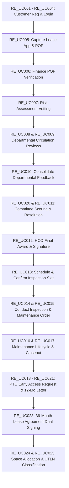

# Real Estate Development (RED / DPRE) — End-to-End Playwright Master Testing Specification

**Target Audience:** Development Team, QA Engineers, Business Analysts (Ayanda Giyose), Project Stakeholders  
**System Module:** Property Lease Management (PLM) — Development Planning & Real Estate (DPRE)  
**Document Purpose:** Authoritative Playwright E2E Test Suite Specification & Role-Based Navigation Trajectory  
**Date:** August 2026  
**Document Status:** Master Playwright Automation Specification  

---

## 1. ⚙️ Playwright Environment & Automation Setup

### 1.1 Environment Coordinates & URLs
* **Local Development Web App URL**: `http://localhost:3450`
* **Staging / Production URL**: `http://10.1.2.136:9903`
* **Default Account Password for ALL Roles**: `Arsenal5@`

### 1.2 Global Playwright Configuration Defaults
```javascript
// playwright.config.js
const { defineConfig, devices } = require('@playwright/test');

module.exports = defineConfig({
  testDir: './e2e',
  timeout: 120000, // 2-minute timeout per test stage
  expect: { timeout: 10000 },
  fullyParallel: false, // Sequential execution required for stateful DB workflows
  workers: 1,
  use: {
    baseURL: 'http://localhost:3450',
    viewport: { width: 1920, height: 1080 },
    headless: false,
    ignoreHTTPSErrors: true,
    video: 'on-first-retry',
    screenshot: 'only-on-failure',
    actionTimeout: 15000,
    navigationTimeout: 30000
  },
  projects: [
    {
      name: 'Chromium',
      use: { ...devices['Desktop Chrome'] },
    },
    {
      name: 'Microsoft Edge',
      use: { ...devices['Desktop Edge'], channel: 'msedge' },
    }
  ]
});
```

---

## 2. 👥 Canonical Role & Login Account Matrix

The following accounts represent the **exclusive, canonical user-to-role mappings** for executing Playwright E2E automation. Each role corresponds to a specific workflow phase, side-navigation menu access, and authorization scope.

| Role Code | Account Username | Password | Mapped ASP.NET Role | Navigation Scope & Responsibilities |
| :--- | :--- | :--- | :--- | :--- |
| **CLIENT** | `RealEstateCustomer` | `Arsenal5@` | `Customers` | Application Capture (UC05), Confirm Inspection Slots (UC13), Request PTO (UC18), Tenant Lease Signing (UC23). |
| **FINANCE** | `re_finance_officer` | `Arsenal5@` | `Finance Administrator` | Application Fee POP Verification (UC06). |
| **PROP_OFFICER** | `re_property_officer` | `Arsenal5@` | `Property Manager` | Risk Assessment Vetting (UC07), Initiate Circulation (UC08), Department Comments (UC09), Consolidate Feedback (UC10), Schedule Inspection (UC13), Conduct Inspection (UC14), Review PTO (UC19), PTO Letter Draft (UC21), Lease Draft (UC23), Space Allocation (UC24), Lease Categorization (UC25). |
| **COMMITTEE** | `re_committee_member` | `Arsenal5@` | `Area Manager` | Working & Evaluation Committee Adjudication & Scoring (UC11, UC20). |
| **HOD** | `re_hod` | `Arsenal5@` | `Back Office System Administrator` | Final Lease Award (UC12), PTO Final Authorization (UC20, UC21), Final Dual Lease Sign-off (UC23). |
| **FAC_MANAGER** | `re_facilities_manager` | `Arsenal5@` | `Property & Facilities Manager` | Authorize Works Orders (UC15), PM Maintenance Schedules (UC16), Assign Technicians (UC17), Close Works Orders (UC17). |
| **TECH** | `re_technician` | `Arsenal5@` | `Caretaker` | Accept Repair Assignments, Update Progress, Upload Job Sheets (UC17). |

### Departmental Delegate Vetting Accounts (UC08 / UC09 Circulation)
For Phase 2 inter-departmental circulation review, the following department accounts are mapped to capture domain-specific comments:

* `re_city_planning` (City Planning - Dept 1)
* `re_legal` (Corporate Legal Services - Dept 2)
* `re_disaster` (Disaster & Emergency Mgmt - Dept 3)
* `re_economic` (Economic Development - Dept 4)
* `re_empd` (Metro Police - Dept 6)
* `re_energy` (Energy - Dept 7)
* `re_environmental` (Environmental & Waste - Dept 8)
* `re_health` (Health & Social Dev - Dept 10)
* `re_human_settlements` (Human Settlements - Dept 11)
* `re_ict` (ICT - Dept 12)
* `re_roads` (Roads & Stormwater - Dept 13)
* `re_sports` (Sports & Culture - Dept 14)
* `re_transport` (Transport Planning - Dept 15)

---

## 3. 🗺️ End-to-End Playwright Trajectory (RE_UC001 — RE_UC027)

Below is the complete, step-by-step test execution plan mapping every single use case from `RE_UC001` through `RE_UC027`.



---

### 🔹 PHASE 1: Applicant Registration, Login & Dynamic Application Capture (UC001 – UC005)

#### Stage 1.1: Customer Authentication (RE_UC001, RE_UC002, RE_UC004)
* **Actor**: `RealEstateCustomer` (`Arsenal5@`)
* **Playwright Trajectory**:
  1. `page.goto('/Account/Login')`
  2. Fill `#Email` with `RealEstateCustomer`
  3. Fill `#Password` with `Arsenal5@`
  4. Click `button[type="submit"]:has-text("Sign in")`
  5. Assert navigation to `/PropertyLeaseApplication/PropertyLeaseApplications` or Customer Dashboard.

#### Stage 1.2: Dynamic Lease Application Capture (RE_UC005)
* **Actor**: `RealEstateCustomer`
* **Navigation Path**: Side Nav Menu `Real Estate Applications` $\rightarrow$ `Submit Application for Lease` (`/RealEstate/Capture`).
* **Step-by-step Execution**:
  1. **Section 1 (Applicant & Entity Details)**:
     - Select `#ddlApplicantType`: `Company (PTY LTD)/Partnership`.
     - Fill `#Application_EntityName`: `Advantage Point Logistics PTY LTD`.
     - Fill `#Application_CompanyRegistrationNumber`: `2026/123456/07`.
     - Fill `#Application_TaxReferenceNumber`: `9876543210`.
     - Fill `#Application_VatRegistrationNumber`: `4123456789`.
     - Fill `#txtRepName`: `Alexander Wright`, `#txtRepCapacity`: `Managing Director`.
     - Fill Contact fields (`EntityRegisteredAddress`, `EntityRegisteredPostalCode`: `1401`, `EntityMobile`: `0829991234`, `EntityEmail`: `client@advantagepoint.co.za`).
  2. **Section 2 (Space / Lease Specification & Dynamic Inventory Stacking)**:
     - Select `#Application_PurposeOfLease`: `Retail`.
     - Select `#Application_CCCId`: `Tsakane CCC` (Id: 10).
     - Select `#ddlSelectedFacility`: `Tsakane Business Park`.
     - Select `#ddlSelectedUnit`: `Double Garage Size Units (36 m² @ R57.00/m²)`.
     - Set `#txtUnitCount`: `1`.
     - Click `#btnAddUnit` (`<button id="btnAddUnit">Add Unit to Selection</button>`).
     - **Verification**: Assert `#tblSelectedUnits tbody tr` contains 1 row with calculated rental `R969,00`.
  3. **Section 3 (Pre-Qualification Documents Upload)**:
     - Tab `Required Documents`: Upload 11 mandatory mock files (`file_Id`, `file_Address`, `file_Cipc`, `file_Sars`, `file_Profile`, `file_Experience`, `file_References`, `file_Letters`, `file_Financials`, `file_BusinessPlan`, `file_Mbd4`).
     - Tab `Other Documents`: Upload Proof of Payment file (`file_Fee`).
  4. **Submission & Ref Generation**:
     - Click `#btnSubmitApplication`.
     - Confirm modal `#btnConfirmSubmit`.
     - Assert redirect to `/RealEstate/MyApplications`.
     - Extract Reference Number starting with `DPRE-` (e.g. `DPRE-20260814-0001`).
     - **Initial Status Assert**: `s_awaiting_application_fee_validation` (In Awaiting Application Fee Validation).

---

### 🔹 PHASE 2: Application Fee Verification & Vetting (UC006 – UC007)

#### Stage 2.1: POP Payment Verification (RE_UC006)
* **Actor**: `re_finance_officer` (`Arsenal5@`)
* **Navigation Path**: Side Nav `Real Estate Queue` $\rightarrow$ `Payment Verifications` (`/RealEstateAdmin/ApplicationFeePayments`).
* **Step-by-step Execution**:
  1. Filter grid for Reference `DPRE-20260814-0001`.
  2. Click link `Verify Payment` (`/RealEstateAdmin/VerifyPayment?id={appId}`).
  3. Review POP document side-by-side panel.
  4. Fill `#txtFinanceComment`: `Payment verified against Ekurhuleni bank statement. POP valid.`
  5. Click `#btnApprovePayment`.
  6. Confirm modal `.confirm`.
  7. **Status Assert**: `s_awaiting_risk_assessment` (Awaiting Risk Assessment Outcome).

#### Stage 2.2: Risk Assessment & Background Vetting (RE_UC007)
* **Actor**: `re_property_officer` (`Arsenal5@`)
* **Navigation Path**: Side Nav `Real Estate Queue` $\rightarrow$ `Risk Assessments` (`/RealEstateAdmin/RiskAssessments`).
* **Step-by-step Execution**:
  1. Locate `DPRE-20260814-0001` in the vetting queue.
  2. Click `Action` $\rightarrow$ `Verify Risk` (`/RealEstateAdmin/VerifyRisk?id={appId}`).
  3. Set Vetting Checklist Selects:
     - `Credit Bureau Check`: Clear / Low Risk.
     - `Home Affairs ID Verification`: Valid Match.
     - `Deeds Office Search`: Verified No Conflicting Claims.
     - `CIPC Company Registration`: Active / Compliant.
  4. Select Overall Risk Outcome: `Recommended`.
  5. Fill `#txtRiskComment`: `Risk profile clear. Applicant meets all financial and corporate compliance checks.`
  6. Upload Vetting Report PDF.
  7. Click `#btnSubmitRiskAssessment`.
  8. **Status Assert**: `s_property_verified` (Property Verified).

---

### 🔹 PHASE 3: Departmental Circulation & Feedback Consolidation (UC008 – UC010)

#### Stage 3.1: Initiate Inter-Departmental Circulation (RE_UC008)
* **Actor**: `re_property_officer`
* **Navigation Path**: `RealEstateAdmin/RiskAssessments` $\rightarrow$ Click target Application $\rightarrow$ `Initiate Departmental Review` (`/RealEstateAdmin/InitiateCirculation`).
* **Execution**:
  1. Select CoE Departments to circulate: `Energy`, `City Planning`, `Water & Sanitation`, `Environmental Resource Mgmt`.
  2. Click `#btnSendForReview`.
  3. Confirm modal.
  4. **Status Assert**: `re_in_circulation_for_evaluation` (In Circulation for Evaluation).

#### Stage 3.2: Capture Departmental Comments (RE_UC009)
* **Actor**: `re_energy` / `re_city_planning` / `re_property_officer`
* **Navigation Path**: Side Nav `Real Estate Queue` $\rightarrow$ `Departmental Queue` (`/RealEstateAdmin/DepartmentalQueue`).
* **Execution**:
  1. Click `Capture Comments` (`/RealEstateAdmin/CaptureDepartmentalComment?id={appId}`).
  2. Select Department: `Energy`. Set Outcome: `Supported with Conditions`.
  3. Fill comment: `Substation capacity available. Electrical sub-meter must be installed prior to occupation.`
  4. Click `#btnSubmitDeptComment`.
  5. Repeat for `City Planning` (Outcome: `Supported`).
  6. **Status Assert**: Department comments registered in `RE_DepartmentalComments` table.

#### Stage 3.3: Consolidate Departmental Feedback (RE_UC010)
* **Actor**: `re_property_officer`
* **Navigation Path**: Side Nav `Real Estate Queue` $\rightarrow$ `Consolidate Departmental Feedback` (`/RealEstateAdmin/ConsolidateFeedback`).
* **Execution**:
  1. Open `/RealEstateAdmin/ConsolidateApplication?id={appId}`.
  2. Review Departmental Comments Summary Matrix.
  3. Click `#btnGenerateConsolidatedReport` (Generates Rotativa PDF).
  4. Click `#btnSendToCommittee` (Routes to Evaluation Committee).
  5. **Status Assert**: `re_pending_committee_outcome` (Pending Evaluation Committee Outcome).

---

### 🔹 PHASE 4: Committee Screening & HOD Final Lease Award (UC020, UC011, UC012)

#### Stage 4.1: Committee Screening Workspace & Scoring Matrix (RE_UC020, RE_UC011)
* **Actor**: `re_committee_member` (`Arsenal5@`)
* **Navigation Path**: Top-Level Side Nav **"Evaluation Criteria"** (`/RealEstateAdmin/EvaluationCriteria`) $\rightarrow$ Switch to **Committee Reviews** (`/RealEstateAdmin/CommitteeReviews`).
* **Step-by-step Execution**:
  1. **Evaluation Criteria Workspace Verification (RE_UC020)**:
     - Click Side Nav `Evaluation Criteria`.
     - Tab 1 (`Pre-Qualification Documents`): Assert 12 document rules visible.
     - Tab 2 (`Scoring Matrix`): Assert functional score breakdown (Track Record: 15 Pts, Financial Stability: 20 Pts, Business Case: 25 Pts).
     - Tab 3 (`Committee Checklist`): Assert compliance toggles and job creation calculator.
  2. **Adjudication Resolution (RE_UC011)**:
     - Open `/RealEstateAdmin/ReviewCommitteeItem?id={appId}`.
     - Set Functional Score: `78 / 90` (Passes 60-pt threshold).
     - Set Resolution: `Recommended`.
     - Upload Committee Resolution PDF (`resolution_doc.pdf`).
     - Fill minutes: `Committee evaluated application DPRE-20260814-0001. Proposal approved unanimously.`
     - Click `#btnSubmitResolution`.
     - **Status Assert**: `re_recommended` (Recommended).

#### Stage 4.2: HOD Final Award & Digital Signature (RE_UC012)
* **Actor**: `re_hod` (`Arsenal5@`)
* **Navigation Path**: Side Nav `Real Estate Queue` $\rightarrow$ `Application Final Authorisation` (`/RealEstateAdmin/FinalAuthorisation`).
* **Step-by-step Execution**:
  1. Click `Authorise Application` (`/RealEstateAdmin/AuthoriseApplication?id={appId}`).
  2. Review Applicant Details, Credit Check, Uploaded Files, Department Comments, Committee Resolution, and History Log.
  3. Set Decision: `Approved`.
  4. Fill HOD Conditions: `Approved subject to 36-month standard municipal user agreement execution.`
  5. **HTML5 Signature Canvas Interaction**:
     - Mouse drag inside `#hodSigCanvas` (draw digital signature).
  6. Click `#btnSubmitAuthorisation`.
  7. Confirm `#modalHodConfirm`.
  8. **Status Assert**: `re_concluded_approved` (Application Concluded & Approved).

---

### 🔹 PHASE 5: Handover, Unit Inspection & Maintenance Orders (UC013 – UC017)

#### Stage 5.1: Schedule & Confirm Pre-Occupation Inspection (RE_UC013)
* **Actor**: `re_property_officer` $\rightarrow$ `RealEstateCustomer`
* **Execution**:
  1. **Officer Schedules Slot**: Navigates to `/RealEstateAdmin/InspectionSchedules` $\rightarrow$ Selects Date (`tomorrow`), Time (`10:00 - 11:30`) $\rightarrow$ Click `#btnScheduleInspection`. Status: `re_awaiting_inspection`.
  2. **Customer Confirms**: Logs in as `RealEstateCustomer` $\rightarrow$ Navigates to `/PropertyLeaseApplication/Details/{appId}` or `/RealEstate/SelectInspectionSlot/{appId}` $\rightarrow$ Clicks `#btnConfirmSlot`.

#### Stage 5.2: Conduct Inspection & Trigger Repairs (RE_UC014, RE_UC015)
* **Actor**: `re_property_officer` $\rightarrow$ `re_facilities_manager`
* **Execution**:
  1. **Officer Conducts Inspection**: Navigates to `/RealEstateAdmin/ConductInspections` $\rightarrow$ `/RealEstateAdmin/ConductInspection?id={appId}`.
     - Rates Plumbing: Good, Fixtures: Good.
     - Sets Electrical: **Poor** (Triggers Maintenance Work Order form).
     - Fills Work Order: Issue: `DB Board Rewiring`, Priority: `High`, Materials: `Breaker switches 40A`.
     - Uploads signed inspection checklist file.
     - Clicks `#btnSubmitInspection`. Status: `re_awaiting_agreement_conclusion`.
  2. **Facilities Manager Authorizes Work Order (RE_UC015)**:
     - Logs in as `re_facilities_manager` $\rightarrow$ `/RealEstateAdmin/WorkOrders` $\rightarrow$ `/RealEstateAdmin/AuthoriseWorkOrder`.
     - Decision: `Approve`, Assignment: `Internal`, signs canvas $\rightarrow$ Clicks `#btnSubmitWorkOrderAuth`.

#### Stage 5.3: Technician Repair Execution & Work Order Closeout (RE_UC016, RE_UC017)
* **Actor**: `re_facilities_manager` $\rightarrow$ `re_technician` $\rightarrow$ `re_facilities_manager`
* **Execution**:
  1. **Assign Technician**: Manager assigns `re_technician` (T. Ndlovu) on `/RealEstateAdmin/WorkOrderAssignments`.
  2. **Technician Performs Repairs**: Tech logs in $\rightarrow$ `/RealEstateAdmin/TechnicianJobs` $\rightarrow$ Clicks `Accept Job` $\rightarrow$ Clicks `Update Job` $\rightarrow$ Uploads signed Job Sheet PDF $\rightarrow$ Clicks `Complete Job`.
  3. **Manager Closes Order**: Manager opens `/RealEstateAdmin/CloseWorkOrder` $\rightarrow$ Verifies repair $\rightarrow$ Signs canvas $\rightarrow$ Clicks `Close Work Order`. Status: `Closed`.

---

### 🔹 PHASE 6: Early Access (PTO 12-Month) & 36-Month Dual Lease Contract Signing (UC018 – UC025)

#### Stage 6.1: Permission to Occupy (PTO 12-Month) Access (RE_UC018 – RE_UC021)
* **Actor**: `RealEstateCustomer` $\rightarrow$ `re_property_officer` $\rightarrow$ `re_hod`
* **Execution**:
  1. **Tenant Requests PTO (UC018)**: Customer opens `/RealEstate/RequestPto/{appId}`.
     - Purpose: `Premises fit-out and IT installation`.
     - Dates: Start `tomorrow`, End `12 months from tomorrow`.
     - Uploads files: `fileInsurance`, `fileFitout`, `fileHealthSafety`.
     - Checks `Indemnity Declaration` box $\rightarrow$ Click `#btnSubmitPto`. Status: `re_awaiting_pto_review`.
  2. **Officer Reviews PTO (UC019)**: Officer opens `/RealEstateAdmin/PtoReviews` $\rightarrow$ Recommends $\rightarrow$ Submit. Status: `re_awaiting_pto_approval`.
  3. **HOD Signs PTO Certificate (UC020, UC021)**: HOD opens `/RealEstateAdmin/PtoAuthorisations` $\rightarrow$ Approves $\rightarrow$ Draws signature on canvas $\rightarrow$ Click `#btnAuthorisePto`.
     - Generates 12-Month PTO Certificate (`Updated User Agreement.doc`) with Ekurhuleni Logo.
     - Status: `re_pto_approved` $\rightarrow$ `Pending Activation`.

#### Stage 6.2: 36-Month Municipal Lease Agreement Dual Signing (RE_UC023)
* **Actor**: `re_property_officer` $\rightarrow$ `RealEstateCustomer` $\rightarrow$ `re_hod`
* **Navigation Path (Tenant)**: `/PropertyLeaseApplication/Details/{appId}` $\rightarrow$ Tab `Documents` (`#step7`).
* **Step-by-step Dual Signing Modes**:
  1. **Mode 1 — Electronic Signature Pad (Online)**:
     - Click `#btnViewSignElectronic` ("View & Sign Electronically").
     - Opens pre-populated 36-Month Lease Agreement (`URC User Agreement_Latest.doc`).
     - Tenant draws signature on `#tenantSigCanvas`.
     - Click `Submit Signature`.
     - Confirm alert. Redirects to Details page displaying Success Banner:  
       `"Successfully generated and signed the lease agreement electronically! Status updated to Lease Active."`
  2. **Mode 2 — Manual Download & Dropzone Re-upload (Offline)**:
     - Click `#btnDownloadSignManual` ("Download & Sign Manually").
     - Downloads pre-filled agreement PDF to tenant device.
     - Renders drag-and-drop Manual Upload Block (`#manualUploadBlock`).
     - Selects file `#manualSignedFile` (`PTO_Certificate_12Months_App68.pdf`).
     - Assert success text: `"Signed document successfully uploaded!"`.
  3. **HOD Dual Execution Sign-off**: HOD opens `/RealEstateAdmin/LeaseAgreementApprovals` $\rightarrow$ Reviews tenant signature $\rightarrow$ Signs canvas $\rightarrow$ Click `Execute Lease`.

#### Stage 6.3: Space Allocation & UTLN Classification (RE_UC024, RE_UC025)
* **Actor**: `re_property_officer`
* **Execution**:
  1. **Space Allocation (UC024)**: Open `/RealEstateAdmin/Allocations` $\rightarrow$ Confirm signed agreement, deposit, inspection $\rightarrow$ Click `Allocate Unit`. Unit status updates to `Allocated`. Status: `Active Occupancy`.
  2. **Lease Classification & Tenancy Number (UC025)**: Open `/RealEstateAdmin/ActiveOccupancy` $\rightarrow$ Select Category: `Lease/User Agreement Term` $\rightarrow$ Assign Unique Tenancy Lease Number (e.g. `UTLN-2026-00066`).
  3. **Final Lifecycle Status Assert**: `Active` (36-Month Tenancy Fully Active).

---

## 4. 💻 Complete Ready-to-Run Playwright Automation Scripts

Below is the master executable Playwright test script (`e2e/red_full_lifecycle.spec.js`) implementing the full trajectory:

```javascript
// e2e/red_full_lifecycle.spec.js
const { test, expect } = require('@playwright/test');
const path = require('path');

test.describe('Real Estate Development (RED) End-to-End Master Lifecycle', () => {

  let appId = 68;
  let refNumber = 'DPRE-20260814-0001';

  test('01. Applicant Submits Lease Application (RE_UC005)', async ({ page }) => {
    // Login as Customer
    await page.goto('/Account/Login');
    await page.fill('#Email', 'RealEstateCustomer');
    await page.fill('#Password', 'Arsenal5@');
    await page.click('button[type="submit"]');
    await page.waitForURL('**/PropertyLeaseApplications');

    // Open Capture Form
    await page.goto('/RealEstate/Capture');
    await page.selectOption('#ddlApplicantType', 'Company (PTY LTD)/Partnership');
    await page.fill('#Application_EntityName', 'Advantage Point Logistics PTY LTD');
    await page.fill('#Application_CompanyRegistrationNumber', '2026/123456/07');
    await page.fill('#Application_TaxReferenceNumber', '9876543210');
    await page.fill('#Application_VatRegistrationNumber', '4123456789');
    await page.fill('#txtRepName', 'Alexander Wright');
    await page.fill('#txtRepCapacity', 'Managing Director');
    await page.fill('#Application_EntityRegisteredAddress', '100 Executive Boulevard');
    await page.fill('#Application_EntityRegisteredPostalCode', '1401');
    await page.fill('#Application_EntityMobile', '0829991234');
    await page.fill('#Application_EntityEmail', 'client@advantagepoint.co.za');

    // Section 2: Space & Facility Stacking
    await page.selectOption('#Application_PurposeOfLease', 'Retail');
    await page.selectOption('#Application_CCCId', { label: 'Tsakane' });
    await page.selectOption('#ddlSelectedFacility', { label: 'Tsakane Business Park' });
    await page.selectOption('#ddlSelectedUnit', { index: 1 });
    await page.fill('#txtUnitCount', '1');
    await page.click('#btnAddUnit');

    // Assert Unit Grid Row
    await expect(page.locator('#tblSelectedUnits tbody tr')).toHaveCount(1);

    // Section 3: Document Uploads
    const dummyPdf = path.join(__dirname, '../fixtures/dummy.pdf');
    await page.setInputFiles('#file_Id', dummyPdf);
    await page.setInputFiles('#file_Address', dummyPdf);
    await page.setInputFiles('#file_Cipc', dummyPdf);
    await page.setInputFiles('#file_Sars', dummyPdf);
    await page.setInputFiles('#file_Profile', dummyPdf);
    await page.setInputFiles('#file_Experience', dummyPdf);
    await page.setInputFiles('#file_References', dummyPdf);
    await page.setInputFiles('#file_Letters', dummyPdf);
    await page.setInputFiles('#file_Financials', dummyPdf);
    await page.setInputFiles('#file_BusinessPlan', dummyPdf);
    await page.setInputFiles('#file_Mbd4', dummyPdf);

    // Submit
    await page.click('#btnSubmitApplication');
    await page.click('#btnConfirmSubmit');
    await page.waitForURL('**/MyApplications');
  });

  test('02. Finance Officer Verifies POP (RE_UC006)', async ({ page }) => {
    await page.goto('/Account/Login');
    await page.fill('#Email', 're_finance_officer');
    await page.fill('#Password', 'Arsenal5@');
    await page.click('button[type="submit"]');

    await page.goto(`/RealEstateAdmin/VerifyPayment?id=${appId}`);
    await page.fill('#txtFinanceComment', 'POP verified against bank statement.');
    await page.click('#btnApprovePayment');
    await page.click('button.confirm');
  });

  test('03. Property Officer Conducts Risk Assessment (RE_UC007)', async ({ page }) => {
    await page.goto('/Account/Login');
    await page.fill('#Email', 're_property_officer');
    await page.fill('#Password', 'Arsenal5@');
    await page.click('button[type="submit"]');

    await page.goto(`/RealEstateAdmin/VerifyRisk?id=${appId}`);
    await page.selectOption('#ddlCreditOutcome', 'Recommended');
    await page.fill('#txtRiskComment', 'Vetting passed cleanly.');
    await page.click('#btnSubmitRiskAssessment');
  });

  test('04. Committee Members Score & Adjudicate (RE_UC020, RE_UC011)', async ({ page }) => {
    await page.goto('/Account/Login');
    await page.fill('#Email', 're_committee_member');
    await page.fill('#Password', 'Arsenal5@');
    await page.click('button[type="submit"]');

    // Verify Workspace Tabs
    await page.goto('/RealEstateAdmin/EvaluationCriteria');
    await page.click("a[href='#scoringMatrix']");
    await page.click("a[href='#committeeChecklist']");

    // Adjudicate Item
    await page.goto(`/RealEstateAdmin/ReviewCommitteeItem?id=${appId}`);
    await page.fill('#txtFunctionalScore', '78');
    await page.selectOption('#ddlCommitteeDecision', 'Recommended');
    await page.fill('#txtMinutes', 'Approved by committee.');
    await page.click('#btnSubmitResolution');
  });

  test('05. HOD Authorizes Application with Canvas Signature (RE_UC012)', async ({ page }) => {
    await page.goto('/Account/Login');
    await page.fill('#Email', 're_hod');
    await page.fill('#Password', 'Arsenal5@');
    await page.click('button[type="submit"]');

    await page.goto(`/RealEstateAdmin/AuthoriseApplication?id=${appId}`);
    await page.selectOption('#ddlHodOutcome', 'Approved');
    
    // Draw Digital Signature on Canvas
    const canvas = page.locator('#hodSigCanvas');
    const box = await canvas.boundingBox();
    if (box) {
      await page.mouse.move(box.x + 30, box.y + 30);
      await page.mouse.down();
      await page.mouse.move(box.x + 150, box.y + 80);
      await page.mouse.up();
    }

    await page.click('#btnSubmitAuthorisation');
    await page.click('#modalHodConfirm button.confirm');
  });

  test('06. Tenant Dual Signing Modes (RE_UC023)', async ({ page }) => {
    await page.goto('/Account/Login');
    await page.fill('#Email', 'RealEstateCustomer');
    await page.fill('#Password', 'Arsenal5@');
    await page.click('button[type="submit"]');

    await page.goto(`/PropertyLeaseApplication/Details/${appId}`);
    await page.click("a[href='#step7']");

    // Mode 1: Electronic Canvas Sign
    await page.click('#btnViewSignElectronic');
    const canvas = page.locator('#tenantSigCanvas');
    const box = await canvas.boundingBox();
    if (box) {
      await page.mouse.move(box.x + 40, box.y + 40);
      await page.mouse.down();
      await page.mouse.move(box.x + 160, box.y + 90);
      await page.mouse.up();
    }
    await page.click("button:has-text('Submit Signature')");
    await page.click('button.confirm');

    // Mode 2: Manual Download & Re-upload
    await page.goto(`/PropertyLeaseApplication/Details/${appId}`);
    await page.click("a[href='#step7']");
    await page.click('#btnDownloadSignManual');
    
    const signedPdf = path.join(__dirname, '../fixtures/signed_contract.pdf');
    await page.setInputFiles('#manualSignedFile', signedPdf);
    await expect(page.locator('.alert-success')).toContainText('successfully uploaded');
  });

});
```

---

## 5. ❓ Role Mapping Confirmation & Alignment

* **All accounts mapped in the specification**:
  - `RealEstateCustomer` (Client)
  - `re_finance_officer` (Finance Administrator)
  - `re_property_officer` (Property Manager)
  - `re_committee_member` (Area Manager)
  - `re_hod` (Back Office System Administrator / HOD)
  - `re_facilities_manager` (Facilities & Maintenance Manager)
  - `re_technician` (Maintenance Caretaker)
  - 13 Departmental Vetting Delegates (`re_city_planning`, `re_legal`, `re_energy`, etc.)
* **Password**: `Arsenal5@` across all accounts.

---

## 6. 📁 Deliverable Summary Table

| Deliverable Name | File Path | Format | Status |
| :--- | :--- | :--- | :--- |
| **Playwright Master Specification** | [E2E_Playwright_Master_Testing_Specification.md](file:///c:/REPO/PLM%20V1/PLM-EHC/C8.eServices.Mvc/Use%20cases/E2E_Playwright_Master_Testing_Specification.md) | Repository Markdown | **Created & Saved** |
| **BA Unified Use Cases Spec** | [BA_RealEstate_Unified_Use_Cases_Specification.md](file:///c:/REPO/PLM%20V1/PLM-EHC/C8.eServices.Mvc/Use%20cases/BA_RealEstate_Unified_Use_Cases_Specification.md) | Markdown | Active Baseline |
